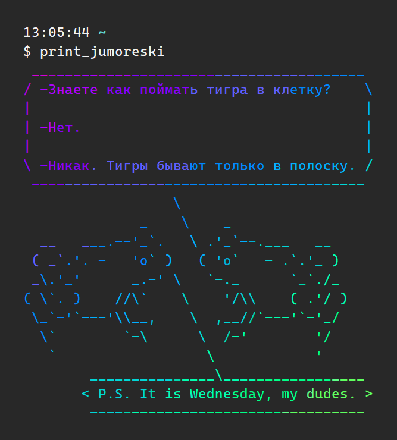

# Jumoreski: Overview

**Bring colorful and funny Jumoreski into your workspace!**



# Table of Contents

- [Install Jumoreski](#install-jumoreski)
  - [Prerequisites](#prerequisites)
  - [Cowsay](#cowsay)
  - [Jumoreski Themselves](#jumoreski-themselves)
  - [Bash Integration](#bash-integration)
- [Licensing](#licensing)

# Install Jumoreski

Some installation guides for specific OS / distributions / package managers:
- [Gentoo/Portage](./INSTALL.gentoo.md)

If you use different system, follow general instructions below.

## Prerequisites

Use your favorite package manager and install `fortune-mod` and `lolcat`.

**Ubuntu users!** Binaries will be installed into `/usr/games`, don't forget to add them to your PATH.

If you do not have root permissions or one of the packages is not available, consider building them from source:
* `fortune-mod`: https://github.com/shlomif/fortune-mod
* `lolcat`: https://github.com/busyloop/lolcat

## Cowsay

Under `cowsay` directory you will find cowsay v3.03 ([github mirror](https://github.com/schacon/cowsay)) with several RHEL patches, mainly fixes for printing Unicode characters correctly + I drew some ASCII frogs for you.

Make sure you have `perl` installed. After that, run `sh cowsay/install.sh` (with `sudo` if you want to install into the system) and follow its instructions.

## Jumoreski Themselves

Put Jumoreski files somewhere where everyone can access them. If you don't want them in `/usr/share/games`, please also change their path in `jumoreski.sh` script!

```bash
$ sudo cp -R jumoreski/ /usr/share/games/
```

## Bash Integration

Make functions available to everyone:
```bash
$ sudo cp jumoreski.sh /etc/profile.d/
```

Or just for yourself:
```bash
$ cat jumoreski.sh >>~/.bashrc
```

Now you can restart your shell and use any of the commands written in `jumoreski.sh` or `fortune`, `cowsay` and `lolcat` commands directly.

You can also `echo 'print_jumoreski' >>~/.bashrc` to have a random one printed every time you open the terminal, with a special message on Wednesdays!

# Licensing

Jumoreski database is collected from VK public group ["Мои любимые юморески"](https://vk.com/jumoreski), the jokes belong to whoever posted them there. Many thanks to [@iAnt0n](https://github.com/iAnt0n) for collecting them and making it possible to run them through `fortune`!

* `fortune-mod` belongs to Shlomi Fish (shlomif@shlomifish.org) and is licensed under original BSD license.
* `lolcat` belongs to busyloop (moe@busyloop.net) and is licensed under BSD 3-Clause.
* `cowsay` belongs to Tony Monroe (tony@nog.net) and is licensed under Artistic License or GPL.

Consider any other code in this repository to be Public Domain and use it however you like.
